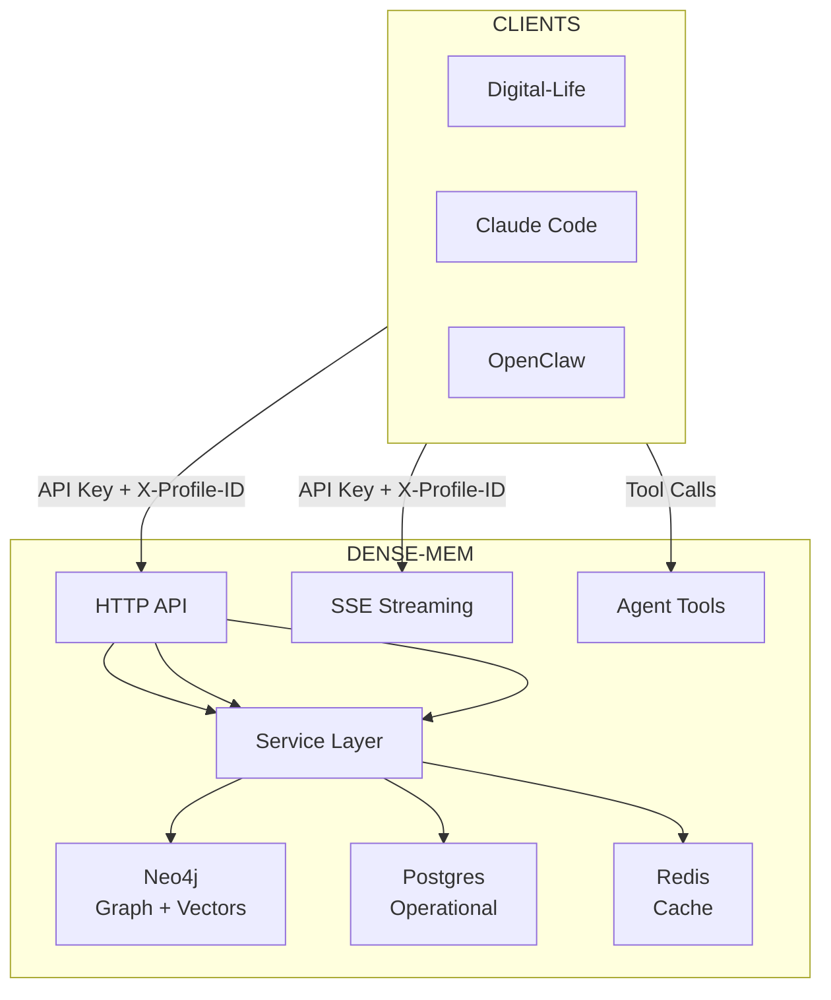
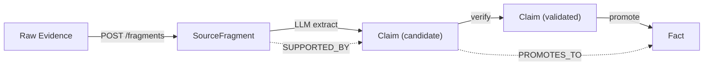

# Dense-Mem Architecture

System architecture loaded at session start.

## Tech Stack

| Component | Technology |
|-----------|------------|
| Language | Go 1.26 |
| HTTP | `github.com/labstack/echo/v5` |
| ORM | `gorm.io/gorm` + `gorm.io/driver/postgres` |
| Validation | `github.com/go-playground/validator/v10` |
| Neo4j | `github.com/neo4j/neo4j-go-driver/v5` |
| Redis | `github.com/redis/go-redis/v9` |
| Config | `github.com/spf13/viper` or env vars |

## System Overview

## Data Stores

| Store | Contents | Isolation Method |
|-------|----------|------------------|
| Neo4j | Knowledge graph, vector indexes | `profile_id` property on every node |
| Postgres | Profiles, API keys, audit logs | `profile_id` column + RLS |
| Redis | Cache, rate limits | Key prefix `profile:{id}:` |

## Knowledge Pipeline

## Authentication

| Key Type | Purpose | Endpoints |
|----------|---------|-----------|
| Standard API Key | Regular operations | `/profiles`, `/knowledge`, `/search`, `/tools` |
| Admin API Key | Admin operations | `/admin/graph/query` (read-only Cypher) |

## Request Flow

1. Validate API key
2. Extract `X-Profile-ID`
3. Rate limit check (Redis)
4. Input validation (struct validator)
5. Service call with profileId
6. Database queries filter by profile_id
7. Response (JSON or SSE)