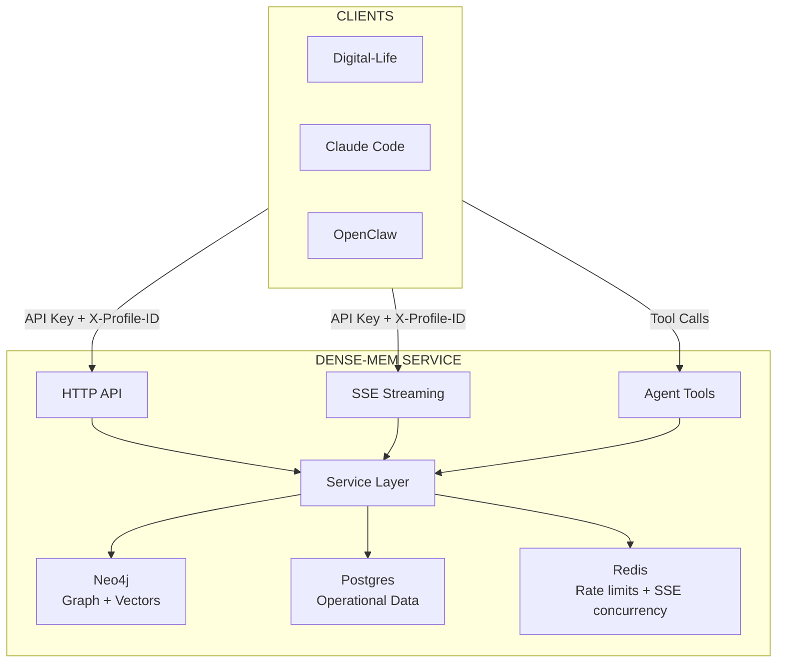
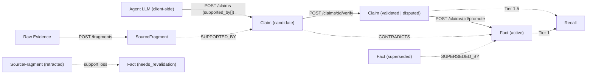

# Dense-Mem

A multi-profile memory service for LLM applications. Provides polyglot persistence (Neo4j + Postgres + optional Redis) with profile isolation, knowledge graph, semantic search, and agent tool support. Redis is optional for single-node deployments and required for multi-instance.

## Purpose

Dense-Mem is a standalone memory layer extracted from digital-life.wiki that:
- Supports **multiple profiles** in a single installation with strict isolation
- Serves **multiple applications** (digital-life instances, Claude Code memory, OpenClaw, etc.)
- Provides **HTTP + SSE streaming** for all memory operations
- Exposes **Agent Tools** for LLM tool use

## Architecture



## Data Stores

| Store | Purpose |
|-------|---------|
| **Neo4j 5.11+** | Knowledge graph (fragments, claims, facts), vector indexes for semantic search |
| **Postgres** | Profile metadata, audit logs, API keys |
| **Redis** | Rate limiting, SSE concurrency (optional for single-node, required for multi-instance) |

## Profile Isolation

Each profile's data is strictly isolated:

- **Neo4j**: `profile_id` property on every node, filtered queries
- **Postgres**: `profile_id` column with RLS policies
- **Redis**: Key prefix `profile:{id}:` (optional for single-node, required for multi-instance)

No cross-profile data access is possible.

## API Overview

### Profile Management
| Endpoint | Description |
|----------|-------------|
| `POST /api/v1/profiles` | Create profile |
| `GET /api/v1/profiles/:id` | Get profile |
| `DELETE /api/v1/profiles/:id` | Delete profile |

### Knowledge Pipeline
| Endpoint | Description |
|----------|-------------|
| `POST /api/v1/fragments` | Ingest raw evidence |
| `POST /api/v1/fragments/:id/retract` | Soft-tombstone a fragment; cascades support recompute |
| `POST /api/v1/claims` | Submit a client-extracted claim with `supported_by[]` |
| `POST /api/v1/claims/:id/verify` | Run NLI entailment against supporting fragments |
| `POST /api/v1/claims/:id/promote` | Promote a validated claim to a Fact (predicate-gated, serialized) |
| `GET /api/v1/facts`, `GET /api/v1/facts/:id` | Read active facts (created only via promotion) |
| `GET /api/v1/recall` | Hybrid tiered recall (Fact → ValidatedClaim → Fragment) |

### Search Tools
| Endpoint | Description |
|----------|-------------|
| `POST /api/v1/tools/semantic-search` | Vector similarity search |
| `POST /api/v1/tools/keyword-search` | Full-text search |
| `POST /api/v1/tools/graph-query` | Read-only graph query |

### Agent Tools
| Endpoint | Description |
|----------|-------------|
| `GET /api/v1/tools` | List available tools |
| `POST /api/v1/tools/{name}` | Execute tool |

### Admin API
| Endpoint | Description |
|----------|-------------|
| `POST /api/v1/admin/graph/query` | Read-only Cypher (admin key) |
| `POST /api/v1/admin/profiles/:id/community/detect` | Per-profile Leiden community detection |
| `POST /api/v1/admin/invariant-scan` | Run invariant-scan job |
| `GET /api/v1/admin/openapi.json` | Full OpenAPI spec |

## Authentication

- **Standard API Key**: `Authorization: Bearer <key>` for regular operations
- **Admin API Key**: Separate key for admin endpoints
- **Profile Selection**: `X-Profile-ID` header specifies which profile

## Quick Start

### Via docker compose (recommended)

```bash
# Copy the committed template and edit secrets if needed (gitignored local copy)
cp docker-compose.example.yml docker-compose.yml
cp .env.example .env   # or start from the .env template generated for docker

# Build images and bring up Postgres, Neo4j, Redis, migrations, and the server
docker compose up -d --build

# Service listens on ${HTTP_PORT:-8080}
curl http://localhost:8080/health
```

### Local Go development

```bash
# Requires Go 1.26+, and a running Postgres + Neo4j (docker or local). Redis is optional for single-node.
cp .env.example .env   # edit DSNs to point at your local services

# Apply migrations and start the server
make migrate-up
make build
./bin/server
```

## Knowledge Pipeline

Extraction is **client-side**. Dense-Mem stores fragments, accepts client-posted claims with their supporting fragment IDs, verifies entailment via NLI, and promotes validated claims to Facts under predicate-gated policies.



`DELETE /fragments/:id` is hard (AC-31). `POST /fragments/:id/retract` is a soft tombstone that cascades a support-recompute: Facts whose remaining support drops below the predicate's gate threshold flip to `needs_revalidation`.

### Reference docs

- [`docs/knowledge-pipeline-contracts.md`](docs/knowledge-pipeline-contracts.md) — stable wire schemas, error codes, recall tier contract
- [`docs/knowledge-pipeline-client-contracts.md`](docs/knowledge-pipeline-client-contracts.md) — client/UI integration guide
- [`docs/knowledge-pipeline-operability.md`](docs/knowledge-pipeline-operability.md) — RBAC, alerts, rollback, risk register
- [`docs/adr/`](docs/adr/) — architectural decision records
- [`docs/policies/`](docs/policies/) — access control + classification policies

## Tech Stack

| Component  | Technology |
|------------|------------|
| Language   | Go 1.26 |
| HTTP       | `github.com/labstack/echo/v4` |
| Validation | `github.com/go-playground/validator/v10` |
| Graph DB   | `github.com/neo4j/neo4j-go-driver/v5` |
| SQL DB     | `gorm.io/gorm` + `gorm.io/driver/postgres` |
| Rate Limits + SSE | `github.com/redis/go-redis/v9` (optional for single-node, required for multi-instance) |
| Migrations | `github.com/pressly/goose/v3` |

## Data Egress

When `AI_API_URL`, `AI_API_KEY`, and `AI_API_EMBEDDING_MODEL` are configured, fragment
content posted to `POST /api/v1/fragments` and recall queries issued to
`GET /api/v1/recall` are sent to the configured embedding provider for vectorization.
The provider sees raw text. Operators must review their provider's data-handling terms
before enabling embedding. Self-hosted providers (Ollama, LM Studio, vLLM) keep data
in-process; SaaS providers (OpenAI, Azure) do not.

`AI_API_KEY` is never logged. The key is redacted from error messages before propagation.
The `embedding/sanitize.go` layer strips provider-specific URLs and tokens from outbound
errors so callers cannot leverage dense-mem as an oracle for provider credentials.

## Embedding Model Consistency

The first successful fragment write records the active embedding model and vector
dimensions in the `embedding_config` Postgres table. On subsequent boots dense-mem
compares the configured `AI_API_EMBEDDING_MODEL` + `AI_API_EMBEDDING_DIMENSIONS` to
the stored record. A mismatch fails startup with an actionable error.

To rotate the embedding model safely:

1. Plan a re-embedding of all existing fragments (future tooling).
2. Truncate the `embedding_config` table or delete the stored row.
3. Redeploy with the new `AI_API_EMBEDDING_MODEL` / `_DIMENSIONS` values.
4. The next successful write seeds the table with the new configuration.

Changing the model without re-embedding corrupts recall quality because the vector
space is no longer comparable. The consistency check exists to prevent this silently.

## Tool Discoverability

Dense-mem exposes four discoverability surfaces, all sourced from a single internal
tool registry so the catalog stays consistent across transports:

| Surface | Path | Audience |
|---------|------|----------|
| JSON catalog | `GET /api/v1/tools` | Runtime agent discovery (filtered by caller scopes + config) |
| AI-safe OpenAPI spec | `GET /api/v1/openapi.json` | AI clients, code generators, traditional consumers |
| Full OpenAPI spec | `GET /api/v1/admin/openapi.json` | Operators, admin tooling, documentation portals |
| MCP stdio server | `./bin/dense-mem-mcp` | Claude Desktop, Claude Code, OpenClaw |

The MCP binary reads `DENSE_MEM_URL`, `DENSE_MEM_API_KEY`, and `DENSE_MEM_PROFILE_ID`
from the environment and proxies tool calls to the HTTP API. Each MCP instance is
pinned to exactly one profile — run multiple instances for multiple profiles.

## Observability

| Metric | Type | Labels |
|--------|------|--------|
| Embedding latency | histogram | `outcome=ok\|timeout\|rate_limited\|error` |
| Embedding errors | counter | `code=timeout\|rate_limited\|error` |
| Recall latency | histogram | — |
| Fragment create | counter | `outcome=created\|duplicate\|error` |
| Fragment retract | counter | — |
| Claim create | counter | `outcome`, `dedupe_reason` |
| Verify verdict | counter | `outcome=verified\|refuted\|inconclusive\|error` |
| Promotion outcome | counter | `outcome=promoted\|skipped\|error` |
| Promote lock wait | histogram | — |
| Fact needs revalidation | counter | — |
| Community detect | counter + histogram | `outcome=ok\|error`, duration + projected-node count |

`X-Correlation-ID` is threaded through every new handler and appears in structured
logs and audit payloads for end-to-end request tracing.

## Development

See [CLAUDE.md](CLAUDE.md) for coding standards.

## License

MIT