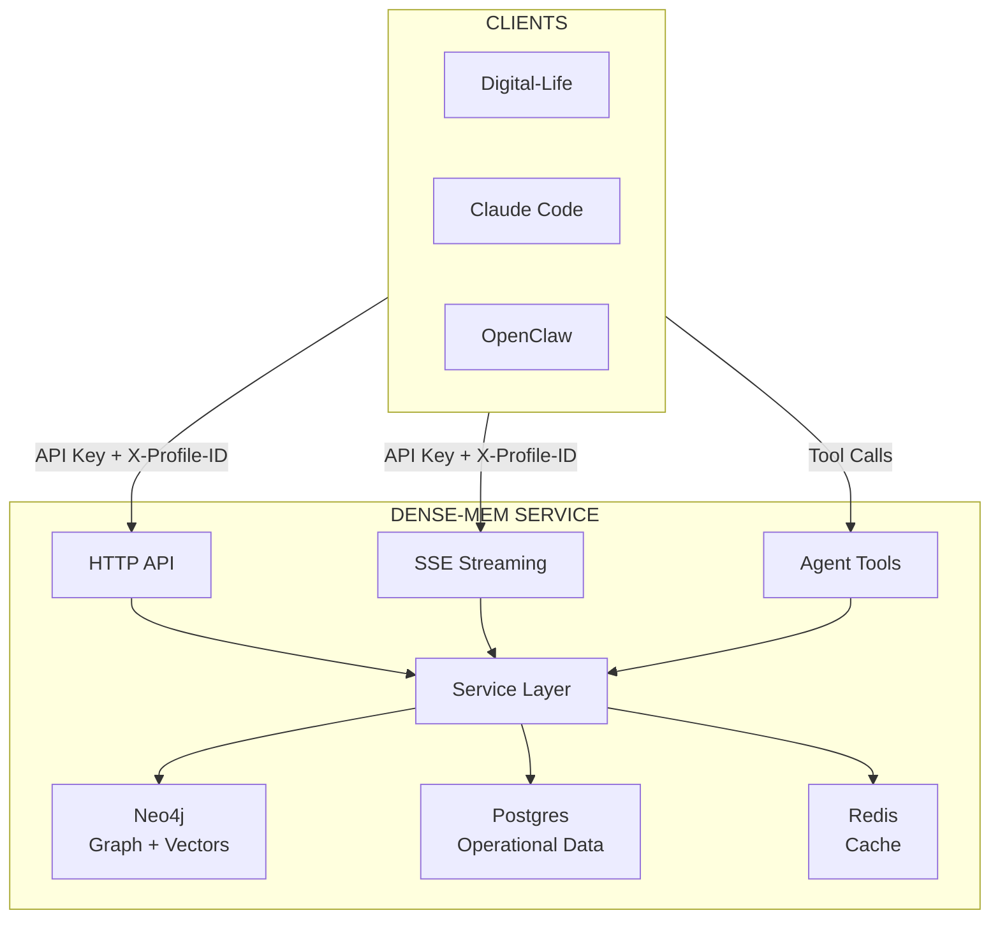
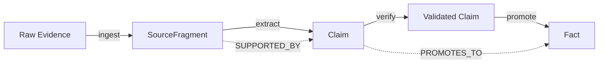

# Dense-Mem

A multi-profile memory service for LLM applications. Provides polyglot persistence (Neo4j + Postgres + Redis) with profile isolation, knowledge graph, semantic search, and agent tool support.

## Purpose

Dense-Mem is a standalone memory layer extracted from digital-life.wiki that:
- Supports **multiple profiles** in a single installation with strict isolation
- Serves **multiple applications** (digital-life instances, Claude Code memory, OpenClaw, etc.)
- Provides **HTTP + SSE streaming** for all memory operations
- Exposes **Agent Tools** for LLM tool use

## Architecture



## Data Stores

| Store | Purpose |
|-------|---------|
| **Neo4j 5.11+** | Knowledge graph (fragments, claims, facts), vector indexes for semantic search |
| **Postgres** | Profile metadata, audit logs, API keys |
| **Redis** | Query cache, rate limiting, session state |

## Profile Isolation

Each profile's data is strictly isolated:

- **Neo4j**: `profile_id` property on every node, filtered queries
- **Postgres**: `profile_id` column with RLS policies
- **Redis**: Key prefix `profile:{id}:`

No cross-profile data access is possible.

## API Overview

### Profile Management
| Endpoint | Description |
|----------|-------------|
| `POST /api/v1/profiles` | Create profile |
| `GET /api/v1/profiles/:id` | Get profile |
| `DELETE /api/v1/profiles/:id` | Delete profile |

### Knowledge Pipeline (HTTP + SSE)
| Endpoint | Description |
|----------|-------------|
| `POST /api/v1/profiles/:id/fragments` | Add raw evidence |
| `POST /api/v1/profiles/:id/claims` | Submit claims |
| `POST /api/v1/profiles/:id/facts` | Create facts |

### Search (HTTP + SSE)
| Endpoint | Description |
|----------|-------------|
| `POST /api/v1/profiles/:id/search/semantic` | Vector similarity search |
| `POST /api/v1/profiles/:id/search/keyword` | BM25 text search |
| `POST /api/v1/profiles/:id/search/hybrid` | Combined search |

### Agent Tools
| Endpoint | Description |
|----------|-------------|
| `GET /api/v1/tools` | List available tools |
| `POST /api/v1/tools/{name}` | Execute tool |

### Admin API
| Endpoint | Description |
|----------|-------------|
| `POST /admin/graph/query` | Read-only Cypher (admin key) |

## Authentication

- **Standard API Key**: `Authorization: Bearer <key>` for regular operations
- **Admin API Key**: Separate key for admin endpoints
- **Profile Selection**: `X-Profile-ID` header specifies which profile

## Quick Start

### Via docker compose (recommended)

```bash
# Copy the committed template and edit secrets if needed (gitignored local copy)
cp docker-compose.example.yml docker-compose.yml
cp .env.example .env   # or start from the .env template generated for docker

# Build images and bring up Postgres, Neo4j, Redis, migrations, and the server
docker compose up -d --build

# Service listens on ${HTTP_PORT:-8080}
curl http://localhost:8080/health
```

### Local Go development

```bash
# Requires Go 1.26+, and a running Postgres + Neo4j + Redis (docker or local)
cp .env.example .env   # edit DSNs to point at your local services

# Apply migrations and start the server
make migrate-up
make build
./bin/server
```

## Knowledge Pipeline



## Tech Stack

| Component  | Technology |
|------------|------------|
| Language   | Go 1.26 |
| HTTP       | `github.com/labstack/echo/v4` |
| Validation | `github.com/go-playground/validator/v10` |
| Graph DB   | `github.com/neo4j/neo4j-go-driver/v5` |
| SQL DB     | `gorm.io/gorm` + `gorm.io/driver/postgres` |
| Cache      | `github.com/redis/go-redis/v9` |
| Migrations | `github.com/pressly/goose/v3` |

## Development

See [CLAUDE.md](CLAUDE.md) for coding standards.

## License

MIT