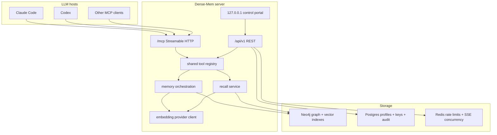
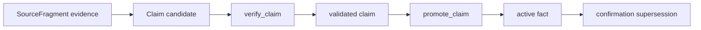

# Dense-Mem

Dense-Mem is a standalone HTTP MCP memory server for LLM hosts. It owns durable
memory state, provenance, typed claims and facts, server-side embeddings,
profile isolation, and recall. The host LLM owns conversation, judgment, and user
interaction.

HTTP MCP is the v1 supported MCP transport. Dense-Mem serves MCP at `/mcp` from
the main HTTP process and also exposes REST, OpenAPI, and a local-only control
portal for profile and API-key administration.

Redis is optional for single-node deployments and required for multi-instance
deployments.

## Responsibility Boundary

| Area | Dense-Mem owns | Host LLM owns |
|------|----------------|---------------|
| Memory writes | Evidence fragments, typed claims, verification, gates, promotion | Extracting candidate memories from chat text |
| Embeddings | Fragment embeddings and recall-query embeddings through the configured provider | No vectors for normal writes or recall |
| Retrieval | Facts, validated claims, fragments, contradictions, clarification tasks | Choosing what to ask or cite in the conversation |
| Truth changes | Comparable-conflict detection, confirmation-driven supersession | Asking the user which uncertain memory is correct |
| Operations | Profiles, API keys, audit metadata, local control portal | Client-side MCP configuration |

Dense-Mem is not an agent brain, planner, or external truth arbiter. It stores
memory, applies explicit gates, and returns structured outcomes.

## Architecture



## Memory Model

Dense-Mem keeps the existing low-level knowledge pipeline:



The high-level MCP tools use that pipeline instead of bypassing it.

| Tool | Purpose |
|------|---------|
| `remember` | Normal chat-session memory insertion. Saves evidence, creates typed claims, verifies, promotes when gates pass, and returns structured outcomes. |
| `import_memories` | Ingests summarized historical conversations. By default it records evidence and validated claims without auto-promotion. |
| `recall_memory` | Retrieves facts, validated claims, fragments, and `clarifications[]` for the authenticated profile. |
| `reflect_memories` | Reviews active facts, candidate or disputed claims, contradictions, stale memories, and clarification needs. |
| `confirm_memory` | Applies the user's answer to a clarification task, either accepting a claim and superseding comparable active facts or keeping/rejecting it. |

Low-level tools remain available for advanced callers: `save_memory`,
`post_claim`, `verify_claim`, `promote_claim`, search tools, graph query tools,
community tools, and retraction tools.

## Promotion Rules

User messages can become active facts only when all of these are true:

1. The host supplies a typed candidate memory.
2. The predicate is in the curated personal-memory allow-list.
3. Verification and promotion gates approve the claim.
4. No comparable active fact conflicts with the new claim.

Curated predicates cover preferences, identity/profile facts, active projects,
goals, corrections, skills, relationships, tool usage, likes, and work facts.

Comparable conflicts are not resolved silently. Dense-Mem returns
`clarifications[]`, and the host LLM should ask the user which memory is correct.
After the user answers, the host calls `confirm_memory`.

Example clarification payload shape:

```json
{
  "clarifications": [
    {
      "type": "memory_conflict",
      "subject": "user",
      "predicate": "prefers",
      "candidate_claim_id": "claim-123",
      "existing_fact_ids": ["fact-456"],
      "question": "Which preference should Dense-Mem keep?"
    }
  ]
}
```

## Embeddings

Dense-Mem owns embeddings for normal writes and recall:

- Clients send text for fragments, `remember`, `import_memories`, and recall.
- Dense-Mem embeds fragments and recall queries through the configured provider.
- Client-supplied vectors are reserved for advanced `semantic-search`.
- The stored embedding model and dimension are checked on startup so vectors from
  incompatible models are not mixed silently.

To rotate embedding models safely:

1. Re-embed stored fragments or plan to rebuild vector indexes.
2. Clear the stored embedding configuration.
3. Redeploy with the new model and dimensions.
4. Let the next successful write seed the new configuration.

## Quick Start

```bash
cp docker-compose.example.yml docker-compose.yml
cp .env.example .env
docker compose up -d --build
curl http://localhost:8080/health
```

The default compose stack provisions `neo4j:5.26-community` with the Neo4j Graph
Data Science plugin enabled. Redis can be omitted for single-node deployments,
but multi-instance deployments need Redis for shared rate limits and SSE
concurrency.

## Provision A Profile And API Key

Dense-Mem API keys are opaque, profile-bound keys. The profile binding lives on
the server side; callers do not send `X-Profile-ID` for header-scoped memory
routes.

The container includes `/app/provision-profile`:

```bash
docker compose exec server /app/provision-profile --name "primary-memory"
```

Local Go development:

```bash
go run ./cmd/provision-profile --name "primary-memory"
```

Example output:

```json
{
  "profile_id": "11111111-2222-3333-4444-555555555555",
  "profile_name": "primary-memory",
  "api_key": "dm_live_..."
}
```

The plaintext `api_key` is returned only at creation time.

Useful operator commands:

```bash
docker compose exec server /app/list-profiles
docker compose exec server /app/list-keys --profile-id "<profile-id>"
docker compose exec server /app/rotate-key --profile-id "<profile-id>" --key-id "<key-id>"
docker compose exec server /app/delete-key --profile-id "<profile-id>" --key-id "<key-id>"
docker compose exec server /app/delete-profile --profile-id "<profile-id>"
```

`delete-profile` hard-deletes the profile, profile-owned API keys, and
profile-owned memory rows. The audit log remains append-only.

## Configure MCP

Use a profile-bound API key:

```bash
export DENSE_MEM_API_KEY="dm_live_..."
```

Dense-Mem serves MCP Streamable HTTP at:

```text
http://localhost:8080/mcp
```

MCP clients authenticate with:

```text
Authorization: Bearer <profile-bound-api-key>
```

### Claude Code

```bash
claude mcp add --transport http dense-mem http://localhost:8080/mcp \
  --header "Authorization: Bearer $DENSE_MEM_API_KEY"
```

You can also pass the key directly:

```bash
claude mcp add --transport http dense-mem http://localhost:8080/mcp \
  --header "Authorization: Bearer dm_live_..."
```

Claude Code documents HTTP MCP servers as the recommended remote-server option
and marks SSE transport as deprecated.

### Codex

Add a Streamable HTTP server to `~/.codex/config.toml` or a trusted project's
`.codex/config.toml`. This is the native Dense-Mem MCP configuration for Codex
CLI and the Codex IDE extension. To store the header directly in the config:

```toml
[mcp_servers.dense_mem]
url = "http://localhost:8080/mcp"
http_headers = { Authorization = "Bearer dm_live_..." }
tool_timeout_sec = 60
enabled = true
```

This stores the API key in plaintext in the Codex config. To keep the key out of
the file, use `bearer_token_env_var` instead:

```toml
[mcp_servers.dense_mem]
url = "http://localhost:8080/mcp"
bearer_token_env_var = "DENSE_MEM_API_KEY"
tool_timeout_sec = 60
enabled = true
```

Codex shares this configuration between the CLI and IDE extension.

### Stdio Compatibility Proxy

Some desktop MCP clients can run stdio MCP commands but do not reliably surface
Streamable HTTP MCP servers in their callable tool registry. For those clients,
use the Dense-Mem stdio proxy.

The npm package is not published yet. After it is published, this will work:

```bash
npx -y @dense-mem/mcp-proxy
```

Until then, run the package from a local checkout or a local `npm pack` tarball.
For a checkout at `/path/to/dense-mem`:

```toml
[mcp_servers.dense_mem]
command = "node"
args = [
  "/path/to/dense-mem/packages/mcp-proxy/bin/dense-mem-mcp-proxy.js",
  "--url",
  "http://127.0.0.1:8080/mcp",
  "--header",
  "Authorization: Bearer dm_live_..."
]
tool_timeout_sec = 60
enabled = true
```

After npm publication, the same configuration can use `npx`:

```toml
[mcp_servers.dense_mem]
command = "npx"
args = [
  "-y",
  "@dense-mem/mcp-proxy",
  "--url",
  "http://127.0.0.1:8080/mcp",
  "--header",
  "Authorization: Bearer dm_live_..."
]
tool_timeout_sec = 60
enabled = true
```

Environment variables are also supported:

```toml
[mcp_servers.dense_mem]
command = "npx"
args = ["-y", "@dense-mem/mcp-proxy"]
env = { DENSE_MEM_MCP_URL = "http://127.0.0.1:8080/mcp", DENSE_MEM_API_KEY = "dm_live_..." }
tool_timeout_sec = 60
enabled = true
```

The proxy supports `--authorization "Bearer ..."` and repeated
`--header "Name: value"` flags. It writes MCP JSON-RPC only to stdout; diagnostic
logs go to stderr with Authorization headers and Dense-Mem API keys redacted.

Claude Desktop can use the same package:

```json
{
  "mcpServers": {
    "dense_mem": {
      "command": "node",
      "args": [
        "/path/to/dense-mem/packages/mcp-proxy/bin/dense-mem-mcp-proxy.js",
        "--url",
        "http://127.0.0.1:8080/mcp",
        "--header",
        "Authorization: Bearer dm_live_..."
      ]
    }
  }
}
```

## HTTP API Surface

| Area | Routes |
|------|--------|
| Health | `GET /health` |
| Fragments | `POST /api/v1/fragments`, `GET /api/v1/fragments`, `GET /api/v1/fragments/{id}`, `DELETE /api/v1/fragments/{id}`, `POST /api/v1/fragments/{id}/retract` |
| Claims | `POST /api/v1/claims`, `GET /api/v1/claims`, `GET /api/v1/claims/{id}`, `DELETE /api/v1/claims/{id}`, `POST /api/v1/claims/{id}/verify`, `POST /api/v1/claims/{id}/promote` |
| Facts | `GET /api/v1/facts`, `GET /api/v1/facts/{id}` |
| Recall | `GET /api/v1/recall` |
| Tools | `GET /api/v1/tools`, `GET /api/v1/tools/{id}`, `POST /api/v1/tools/{name}` |
| Profiles | `GET /api/v1/profiles/{profileId}`, `PATCH /api/v1/profiles/{profileId}`, `GET /api/v1/profiles/{profileId}/audit-log` |
| Streaming | `POST /api/v1/profiles/{profileId}/query/stream` |
| Communities | `GET /api/v1/communities`, `GET /api/v1/communities/{id}` |
| MCP | `POST /mcp`, `GET /mcp` |

Header-scoped memory routes derive the profile from the bearer API key.

Example:

```bash
curl http://localhost:8080/api/v1/tools \
  -H "Authorization: Bearer $DENSE_MEM_API_KEY"
```

```bash
curl "http://localhost:8080/api/v1/recall?q=preferences" \
  -H "Authorization: Bearer $DENSE_MEM_API_KEY"
```

## Local Control Portal

The optional control portal is for local profile and API-key management only. It
does not expose a memory, fact, claim, graph, or database browser.

Environment variables:

```bash
CONTROL_PORTAL_ENABLED=false
CONTROL_HTTP_ADDR=127.0.0.1:8090
CONTROL_PORTAL_TOKEN=
```

With the local Docker compose setup, the portal is available at
`http://127.0.0.1:8090/` when `CONTROL_PORTAL_ENABLED=true`. The server
container uses host networking so the portal still binds to the host loopback
address instead of `0.0.0.0`.

When enabled, Dense-Mem validates all of the following before starting the
portal:

- `CONTROL_PORTAL_TOKEN` must be set.
- `CONTROL_HTTP_ADDR` must bind to loopback (`127.0.0.1`, `::1`, or
  `localhost`).
- Requests must include the portal token.
- Browser `Origin` headers must be loopback origins.

The portal supports:

- list, create, update, and delete profiles where the existing profile rules
  allow deletion
- list, create, and delete API keys
- one-time plaintext key display immediately after key creation

## Data Egress

Dense-Mem validates required embedding configuration at server startup. Fragment
content and recall queries are forwarded to the configured embedding provider
for vectorization. Claim verification uses `AI_VERIFIER_API_URL`,
`AI_VERIFIER_API_KEY`, and `AI_VERIFIER_MODEL`; when verifier URL/key are unset,
verification falls back to `AI_API_URL` and `AI_API_KEY`.

The embedding provider sees raw fragment/query text. The verifier provider sees
candidate claims and supporting evidence. Operators must review provider terms
before enabling external AI services. Self-hosted providers keep traffic inside
your boundary; hosted providers do not.

## Tool Discoverability

Dense-Mem exposes three discoverability surfaces backed by one registry:

| Surface | Path | Purpose |
|---------|------|---------|
| Tool catalog | `GET /api/v1/tools` | Runtime tool discovery |
| Runtime OpenAPI | `GET /api/v1/openapi.json` | Agents, codegen, integrations |
| MCP Streamable HTTP | `POST /mcp`, `GET /mcp` | MCP clients over the main HTTP service |

`POST /mcp` handles JSON-RPC requests and can return JSON or SSE when requested.
`GET /mcp` opens the server-to-client SSE stream where supported.

## Reference Docs

- [standalone MCP memory architecture](docs/standalone-mcp-memory-architecture.md)
- [knowledge-pipeline contracts](docs/knowledge-pipeline-contracts.md)
- [knowledge-pipeline client contracts](docs/knowledge-pipeline-client-contracts.md)
- [knowledge-pipeline operability](docs/knowledge-pipeline-operability.md)

## License

MIT
