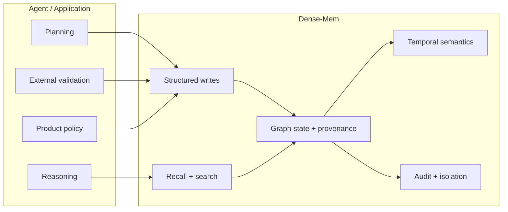
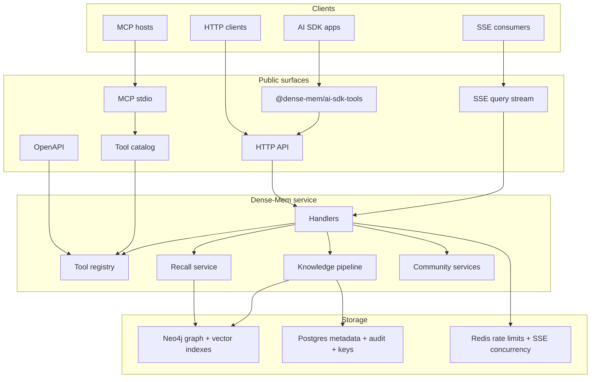
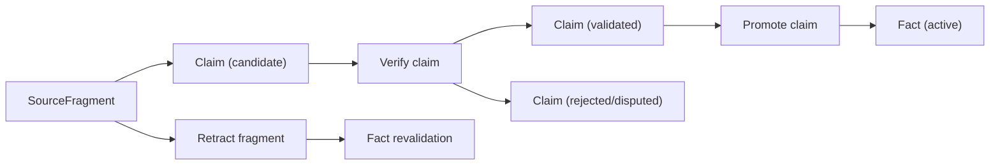
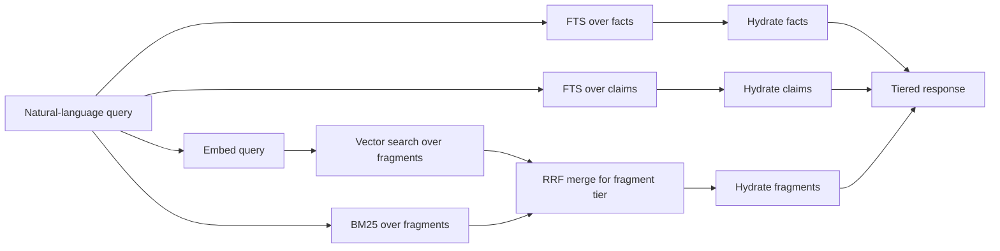
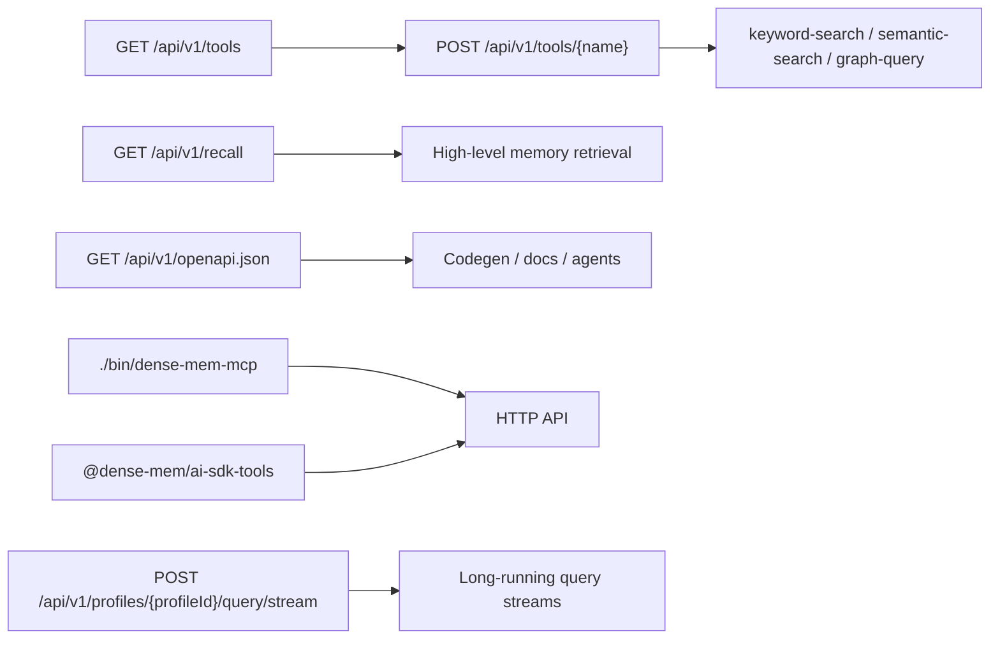
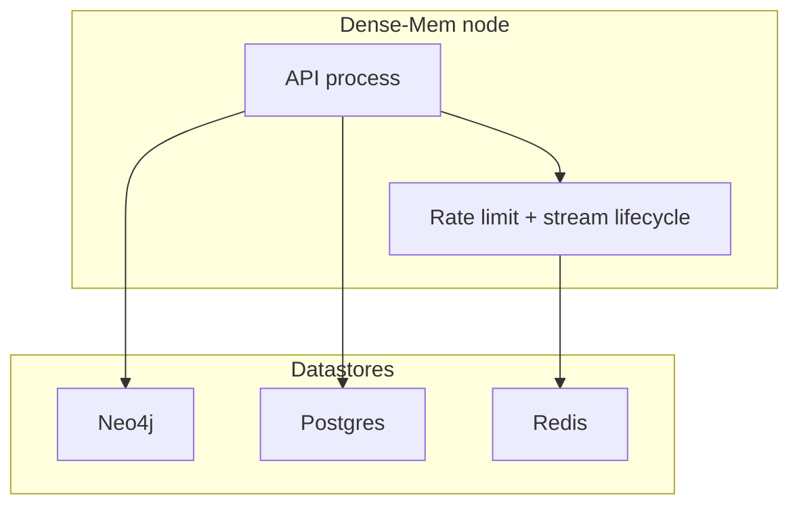

# Dense-Mem

Dense-mem is a graph-backed memory and knowledge database for LLM applications. It is responsible for durable graph state, provenance, temporal semantics, structured writes, retrieval, and AI-facing tool execution. It is not the agent brain, planner, or truth arbiter.

Redis is optional for single-node deployments and required for multi-instance deployments.

## What Dense-Mem Is Responsible For

- Persisting fragments, claims, facts, communities, audit data, and profile metadata
- Preserving provenance and evidence links instead of flattening everything into text blobs
- Tracking time with `valid_at` and `known_at` semantics where they matter
- Exposing structured write primitives such as fragment ingest, claim creation, verify, promote, and retract
- Providing retrieval surfaces for high-level recall, keyword search, semantic search, and graph queries
- Publishing a discoverable tool surface over HTTP, OpenAPI, MCP, and an npm AI SDK package

## Responsibility Boundary



Dense-mem stores and retrieves memory. Upstream agents and applications decide what to write, when to verify or promote, how to validate against external context, and how to act on the results.

## Architecture



## Structured Write Flow

`verify` and `promote` remain public, but they are optional structured-write primitives, not the only way to use dense-mem.



## Retrieval Flow

High-level recall is the primary memory retrieval contract. Lower-level search tools remain available when callers need direct control.



`GET /api/v1/recall` returns tiered results:

- Tier `1`: active facts
- Tier `1.5`: validated claims
- Tier `2`: fragments

## Integration Surfaces



## Runtime Layout



## Data Stores

| Store | Role |
|------|------|
| `Neo4j` | Graph state, provenance edges, full-text indexes, vector indexes |
| `Postgres` | Profiles, API keys, audit log, embedding configuration |
| `Redis` | Rate limiting and SSE concurrency for single-node and multi-instance operation |

## Profile Isolation

- Neo4j queries are profile-scoped and every knowledge-pipeline relationship carries `profile_id`
- Postgres uses profile-scoped records with RLS helper wiring
- Redis keys are profile-aware and support single-node and multi-instance deployments

## Public API Surface

| Area | Routes |
|------|------|
| Fragments | `POST /api/v1/fragments`, `GET /api/v1/fragments`, `GET /api/v1/fragments/{id}`, `DELETE /api/v1/fragments/{id}`, `POST /api/v1/fragments/{id}/retract` |
| Claims | `POST /api/v1/claims`, `GET /api/v1/claims`, `GET /api/v1/claims/{id}`, `DELETE /api/v1/claims/{id}`, `POST /api/v1/claims/{id}/verify`, `POST /api/v1/claims/{id}/promote` |
| Facts | `GET /api/v1/facts`, `GET /api/v1/facts/{id}` |
| Recall | `GET /api/v1/recall` |
| Tooling | `GET /api/v1/tools`, `GET /api/v1/tools/{id}`, `POST /api/v1/tools/{name}` |
| Profiles | `GET /api/v1/profiles/{profileId}`, `PATCH /api/v1/profiles/{profileId}`, `GET /api/v1/profiles/{profileId}/audit-log` |
| Streaming | `POST /api/v1/profiles/{profileId}/query/stream` |
| Communities | `GET /api/v1/communities`, `GET /api/v1/communities/{id}` |

## npm Package

The repo now includes [`packages/ai-sdk-tools`](packages/ai-sdk-tools/README.md), the tools-only package intended to publish as `@dense-mem/ai-sdk-tools` for Vercel AI SDK consumers.

It does two things:

- Loads the live HTTP tool catalog from `GET /api/v1/tools`
- Adds an explicit `recall_knowledge` tool over `GET /api/v1/recall`

Example:

```ts
import { generateText } from 'ai';
import { openai } from '@ai-sdk/openai';
import { createDenseMemTools } from '@dense-mem/ai-sdk-tools';

const tools = await createDenseMemTools({
  baseUrl: process.env.DENSE_MEM_URL,
  apiKey: process.env.DENSE_MEM_API_KEY,
  profileId: process.env.DENSE_MEM_PROFILE_ID,
});

const result = await generateText({
  model: openai('gpt-5.4'),
  tools,
  prompt: 'Recall the most relevant memory about my next trip.',
});
```

## Quick Start

### Docker Compose

The default compose stack provisions `neo4j:5.26-community` with the Neo4j Graph Data Science plugin enabled, so community detection works out of the box in local/dev.

`dense-mem` also supports Neo4j Enterprise + GDS, but that is not bundled in this repository's default setup. If you want Enterprise, bring your own Neo4j image/license/config and keep the same application config.

```bash
cp docker-compose.example.yml docker-compose.yml
cp .env.example .env
docker compose up -d --build
curl http://localhost:8080/health
```

### Provision A Profile And API Key

There is no UI and there are no public control-plane HTTP endpoints. Control-plane tasks are handled by local or container commands.

The image includes `/app/provision-profile`, a helper command that creates:

- one new profile
- one new profile-bound standard API key

The returned `api_key` is an opaque long-lived key, not a JWT. The profile binding lives on the server side.

The command talks directly to Postgres. It does not require the HTTP server to be running and it does not require Neo4j, Redis, or embedding configuration.

Run it inside the running container:

```bash
docker compose exec server /app/provision-profile --name "primary-memory"
```

Or run it as a one-off container:

```bash
docker compose run --rm server /app/provision-profile --name "primary-memory"
```

Or run it locally in Go:

```bash
go run ./cmd/provision-profile --name "primary-memory"
```

Example output:

```json
{
  "profile_id": "11111111-2222-3333-4444-555555555555",
  "profile_name": "primary-memory",
  "api_key": "dm_live_...",
  "key_label": "default",
  "scopes": [
    "read",
    "write"
  ]
}
```

The plaintext `api_key` is only returned at creation time.

Supported flags:

- `--name`: required profile name
- `--description`: optional profile description
- `--metadata-json`: optional profile metadata JSON object
- `--config-json`: optional profile config JSON object
- `--key-label`: optional API key label, default `default`
- `--scopes`: comma-separated scopes, default `read,write`
- `--rate-limit`: optional per-key rate-limit override
- `--expires-at`: optional RFC3339 expiration time

Example with more fields:

```bash
docker compose exec server /app/provision-profile \
  --name "primary-memory" \
  --description "Primary memory profile" \
  --metadata-json '{"owner":"ops","env":"dev"}' \
  --config-json '{"memory_mode":"default"}' \
  --key-label "bootstrap" \
  --scopes "read,write" \
  --expires-at "2026-12-31T23:59:59Z"
```

By default the generated key is long-lived and does not expire.

### Operator Commands

The same container image ships the rest of the lifecycle commands:

- `/app/list-profiles`
- `/app/list-keys --profile-id <uuid>`
- `/app/rotate-key --profile-id <uuid> --key-id <uuid>`
- `/app/revoke-key --profile-id <uuid> --key-id <uuid>`
- `/app/delete-profile --profile-id <uuid>`

Examples:

```bash
docker compose exec server /app/list-profiles
```

```bash
docker compose exec server /app/list-keys \
  --profile-id "$DENSE_MEM_PROFILE_ID"
```

```bash
docker compose exec server /app/rotate-key \
  --profile-id "$DENSE_MEM_PROFILE_ID" \
  --key-id "<existing-key-id>"
```

```bash
docker compose exec server /app/revoke-key \
  --profile-id "$DENSE_MEM_PROFILE_ID" \
  --key-id "<existing-key-id>"
```

```bash
docker compose exec server /app/delete-profile \
  --profile-id "$DENSE_MEM_PROFILE_ID"
```

`delete-profile` only succeeds after all active keys for that profile have been revoked or expired.

### Use The Returned Credentials

Export the returned values:

```bash
export DENSE_MEM_PROFILE_ID="11111111-2222-3333-4444-555555555555"
export DENSE_MEM_API_KEY="dm_live_..."
```

Current HTTP auth rules:

- Always send `Authorization: Bearer $DENSE_MEM_API_KEY`
- Header-scoped routes also require `X-Profile-ID: $DENSE_MEM_PROFILE_ID`
- Path-scoped routes use `/api/v1/profiles/{profileId}` in the URL instead of the header

Header-scoped routes today include:

- `/api/v1/tools`
- `/api/v1/fragments`
- `/api/v1/claims`
- `/api/v1/facts`
- `/api/v1/communities`
- `/api/v1/recall`

Example requests:

```bash
curl http://localhost:8080/api/v1/tools \
  -H "Authorization: Bearer $DENSE_MEM_API_KEY" \
  -H "X-Profile-ID: $DENSE_MEM_PROFILE_ID"
```

```bash
curl http://localhost:8080/api/v1/recall?q=trip \
  -H "Authorization: Bearer $DENSE_MEM_API_KEY" \
  -H "X-Profile-ID: $DENSE_MEM_PROFILE_ID"
```

```bash
curl http://localhost:8080/api/v1/profiles/$DENSE_MEM_PROFILE_ID \
  -H "Authorization: Bearer $DENSE_MEM_API_KEY"
```

### Local Go Development

```bash
cp .env.example .env
make migrate-up
make build
./bin/server
```

To provision a profile locally without Docker:

```bash
go run ./cmd/provision-profile --name "primary-memory"
```

## Data Egress

Dense-mem validates its required embedding configuration at server startup. Fragment content sent to `POST /api/v1/fragments` and recall queries sent to `GET /api/v1/recall` are forwarded to the configured embedding provider for vectorization.

This means the provider sees raw text. Operators must review provider terms before enabling external embeddings. Self-hosted providers keep the traffic inside your boundary; hosted providers do not.

## Embedding Model Consistency

Dense-mem records the active embedding model and dimensions in Postgres and checks them again on startup. If the configured model or dimensions drift from the stored values, startup fails instead of silently corrupting vector comparability.

To rotate safely:

1. Re-embed or plan to rebuild the fragment vectors.
2. Clear the stored embedding configuration.
3. Redeploy with the new model and dimensions.
4. Let the next successful write seed the new configuration.

## Tool Discoverability

Dense-mem exposes three discoverability surfaces backed by one registry:

| Surface | Path | Purpose |
|------|------|------|
| Tool catalog | `GET /api/v1/tools` | Runtime tool discovery |
| Runtime OpenAPI | `GET /api/v1/openapi.json` | Agents, codegen, integrations |
| MCP stdio | `./bin/dense-mem-mcp` | MCP hosts that proxy to the HTTP API |

The MCP binary is stdio-based today. The AI SDK package is HTTP-based today.

## Reference Docs

- [knowledge-pipeline contracts](docs/knowledge-pipeline-contracts.md)
- [knowledge-pipeline client contracts](docs/knowledge-pipeline-client-contracts.md)
- [knowledge-pipeline operability](docs/knowledge-pipeline-operability.md)
- [package README](packages/ai-sdk-tools/README.md)

## License

MIT
