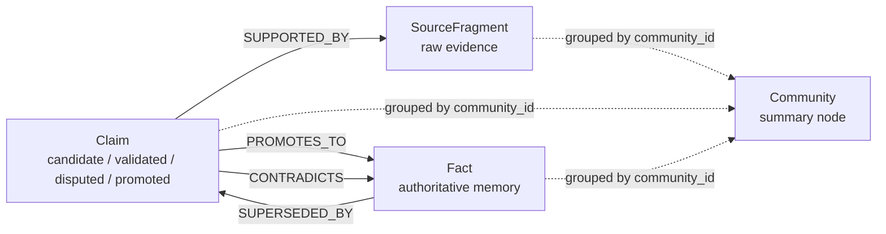
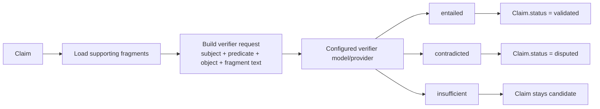

# Knowledge Pipeline Contracts

This document defines the stable contracts for the knowledge pipeline components.
Consumers — HTTP handlers, MCP tools, and integration tests — MUST depend on these
contracts rather than internal implementation details.

## Pipeline Stages

| Stage | Input | Output | Route |
|-------|-------|--------|-------|
| 1. Fragment ingestion | Raw evidence text | `SourceFragment` node | `POST /api/v1/fragments` |
| 2. Claim creation | `fragment_id` + claim text | `Claim (candidate)` node | `POST /api/v1/claims` |
| 3. Claim verification | `claim_id` | `Claim (validated)` or `Claim (disputed)` | `POST /api/v1/claims/{id}/verify` |
| 4. Fact promotion | `claim_id` (validated only) | `Fact (active)` node | `POST /api/v1/claims/{id}/promote` |
| 5. Fact revalidation | Fragment retraction event | Fact status updated | (internal trigger) |
| 6. Fragment retraction | `fragment_id` | Soft-tombstone + revalidation | `POST /api/v1/fragments/{id}/retract` |
| 7. Community detection | `profile_id` + algorithm | Community assignments | `POST /api/v1/tools/detect_community` |
| 9. Hybrid recall | Query string | Ranked `RecallHit` list (tiers 1/1.5/2) | `GET /api/v1/recall` |

## Entity Relationships



Fragments are stored evidence units. Claims are structured propositions derived
from fragments and retain their lineage through the `SUPPORTED_BY` edge.
Facts are promoted claims that dense-mem treats as authoritative memory until a
new contradiction or superseding claim changes that state. Communities are a
summary layer over fragments, claims, and facts that share a `community_id`.

## Claim Validation Flow



Dense-mem does not self-validate claims through graph topology alone. A
configured verifier model/provider evaluates the claim against its supporting
fragments and returns the status transition. That makes the graph durable and
traceable, while validation policy stays explicit and replaceable.

## Recall Tier Definitions

| Tier | Label | Source | Score Basis |
|------|-------|--------|-------------|
| `"1"` | Active Fact | Promoted `Fact` node | `fact.truth_score` |
| `"1.5"` | Validated Claim | `Claim` with `status=validated` | `claim.extract_conf * 0.5` |
| `"2"` | Source Fragment | `SourceFragment` node | RRF merged semantic + keyword rank |

Tier `"1"` outranks `"1.5"` under equal base scores due to the 0.5 claim weight.
Only query-matched active facts and query-matched validated claims are included.
`candidate` and `disputed` claims are excluded.

## RecallHit Schema

```json
{
  "tier": "1 | 1.5 | 2",
  "score": 0.85,
  "fragment": { "...": "populated for tier 2 only" },
  "claim": { "...": "populated for tier 1.5 only" },
  "fact": { "...": "populated for tier 1 only" },
  "semantic_rank": 1,
  "keyword_rank": 2,
  "final_score": 0.016
}
```

Exactly one of `fragment`, `claim`, or `fact` is non-null per hit.

## Profile Isolation Invariant

Every pipeline operation MUST filter by `profile_id`. The recall service enforces
this at two levels:
1. Each branch query carries the `{profile_id: $profileId}` parameter
2. Post-filter drops any hit whose `ProfileID` does not match the caller's profile

## Error Contracts

| Error | HTTP Code | Trigger |
|-------|-----------|---------|
| `ErrEmbeddingUnavailable` | 503 | Embedding provider down or unconfigured |
| `ErrKeywordUnavailable` | 503 | BM25 index unavailable |
| Missing `query` parameter | 400 | Validation failure |
| Missing profile context | 400 | Auth middleware did not resolve profile |
