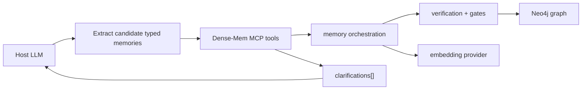
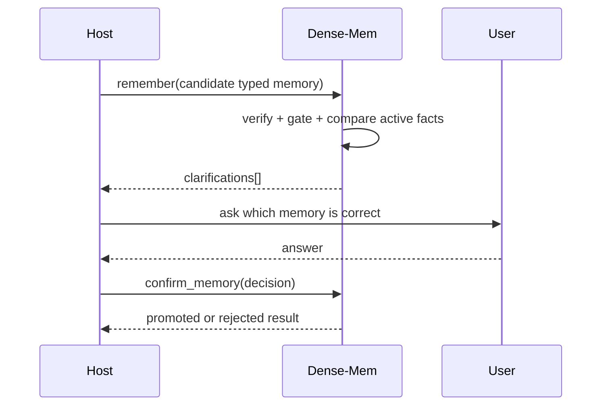

# Standalone MCP Memory Architecture

## Scope

Dense-Mem is a standalone HTTP MCP memory server. It is designed for LLM hosts
that need durable personal or project memory without embedding memory storage
inside the host process.

The v1 supported MCP transport is Streamable HTTP at `/mcp`. REST and OpenAPI
surfaces are maintained for non-MCP integrations and operational tooling.

## Design Goals

- Keep memory state outside the host LLM.
- Preserve evidence provenance instead of storing opaque summaries only.
- Let Dense-Mem own embeddings for normal writes and recall.
- Promote only typed, gate-approved personal-memory claims.
- Return clarification tasks instead of choosing silently during comparable
  conflicts.
- Keep profile and API-key administration local-only.
- Preserve optional Redis operation for single-node deployments while requiring
  Redis for multi-instance rate limits and SSE concurrency.

## System Boundary



The host LLM should extract candidate memory objects from conversation text. It
should not send embedding vectors for normal memory insertion or recall. Dense-Mem
validates, embeds, persists, gates, and returns structured outcomes.

## Data Model

Dense-Mem uses a three-layer memory model:

| Layer | Role | Notes |
|-------|------|-------|
| `SourceFragment` | Immutable evidence | Stores original text, source metadata, embedding model, embedding dimensions, and provenance. |
| `Claim` | Typed candidate assertion | Stores subject, predicate, object, confidence, verification status, and evidence links. |
| `Fact` | Promoted active memory | Stores current or historical facts with status, truth score, and supersession metadata. |

Facts are not overwritten in place. Corrections create new facts and supersede
older comparable facts so audit and history remain intact.

## High-Level MCP Tools

### `remember`

Normal chat-session insertion.

1. Save source evidence as a fragment.
2. Embed the fragment through the configured provider.
3. Create typed claims from host-supplied candidate memories.
4. Verify each claim against evidence.
5. Run promotion gates.
6. Promote only if no comparable active fact conflicts.
7. Return created evidence, claim outcomes, promoted facts, rejections, and
   clarification tasks.

### `import_memories`

Historical conversation import.

The import path favors preservation over aggressive promotion. By default it
saves evidence and validated claims without turning summarized history into
active facts. Callers can opt into auto-promotion when the summary is trusted and
the same gates still pass.

### `recall_memory`

Profile-scoped retrieval.

Recall combines active facts, validated claims, fragments, and clarification
needs. Results include `clarifications[]` so host LLMs can ask the user about
conflicts during normal chat.

### `reflect_memories`

Memory review.

Reflection summarizes active facts, candidate or disputed claims,
contradictions, stale memories, and clarification needs. It is the periodic
maintenance surface for hosts that want to review memory health.

### `confirm_memory`

Clarification resolution.

After the host asks the user which memory is correct, it calls
`confirm_memory`. Accepting the candidate claim promotes it and supersedes
comparable active facts. Keeping the existing fact rejects or leaves the
candidate unpromoted.

## Predicate Policy

Dense-Mem only auto-promotes curated personal-memory predicates. The allow-list
covers:

- preferences
- identity and profile facts
- active projects
- goals
- corrections
- skills
- relationships
- tools or technologies the user uses
- likes
- work facts

Unsupported predicates can still exist as claims, but they do not become active
facts through high-level memory insertion.

## Conflict And Clarification Flow



Comparable conflicts include facts with the same profile, subject, predicate,
and comparable object space. Dense-Mem must not infer which one the user meant.

## Embedding Ownership

Normal write and recall paths accept text. Dense-Mem embeds:

- fragment content
- imported memory summaries
- recall queries

Client-supplied vectors remain limited to advanced semantic search. The server
preserves model and dimension consistency checks so vector indexes are not mixed
across incompatible providers.

## Profile Isolation

Every memory operation is scoped to the authenticated API key's profile. MCP and
header-scoped HTTP routes ignore caller-supplied `profile_id` values. Path-scoped
profile-management routes still include the profile ID in the path where the
existing API contract requires it.

Graph nodes and relationships carry profile scope, SQL records are profile-bound,
and Redis keys use profile-aware prefixes.

## HTTP MCP Transport

Dense-Mem implements MCP Streamable HTTP at one endpoint:

| Method | Path | Purpose |
|--------|------|---------|
| `POST` | `/mcp` | JSON-RPC requests and notifications; JSON or SSE response. |
| `GET` | `/mcp` | Server-to-client SSE stream where supported. |

Security requirements:

- Authenticate with bearer API keys.
- Validate `Origin` on local browser-accessible HTTP surfaces.
- Bind local-only administrative surfaces to loopback.
- Keep the server-owned MCP transport HTTP-first. The optional stdio proxy under
  `packages/mcp-proxy` is a local adapter for clients that cannot load
  Streamable HTTP MCP servers directly; it is not a separate Dense-Mem server
  transport. Publish it to npm before relying on `npx dense-mem-mcp-proxy` as
  a release install path.

## Local Control Portal

The portal is intentionally narrow:

```text
web/
  src/
    App.tsx
    api.ts
    styles.css
  tests/
    control-portal.spec.ts
```

It manages profiles and API keys only. It does not browse or mutate memory,
facts, claims, graph nodes, or database internals.

Runtime controls:

| Variable | Default | Meaning |
|----------|---------|---------|
| `CONTROL_PORTAL_ENABLED` | `false` | Enables the local portal server. |
| `CONTROL_HTTP_ADDR` | `127.0.0.1:8090` | Loopback bind address. |
| `CONTROL_PORTAL_TOKEN` | empty | Required bearer or `X-Control-Portal-Token` token when enabled. |

The server rejects unsafe binds, missing tokens, invalid tokens, and non-loopback
browser origins.

## Operational Notes

- Redis is optional for single-node use.
- Redis is required for multi-instance deployments because rate-limit counters
  and SSE stream concurrency must be shared.
- API keys are shown in plaintext only once when created.
- Embedding provider traffic is data egress when the provider is hosted outside
  the operator boundary.
- The tool registry is the source of truth for MCP, HTTP tool catalog, and
  OpenAPI discoverability.
